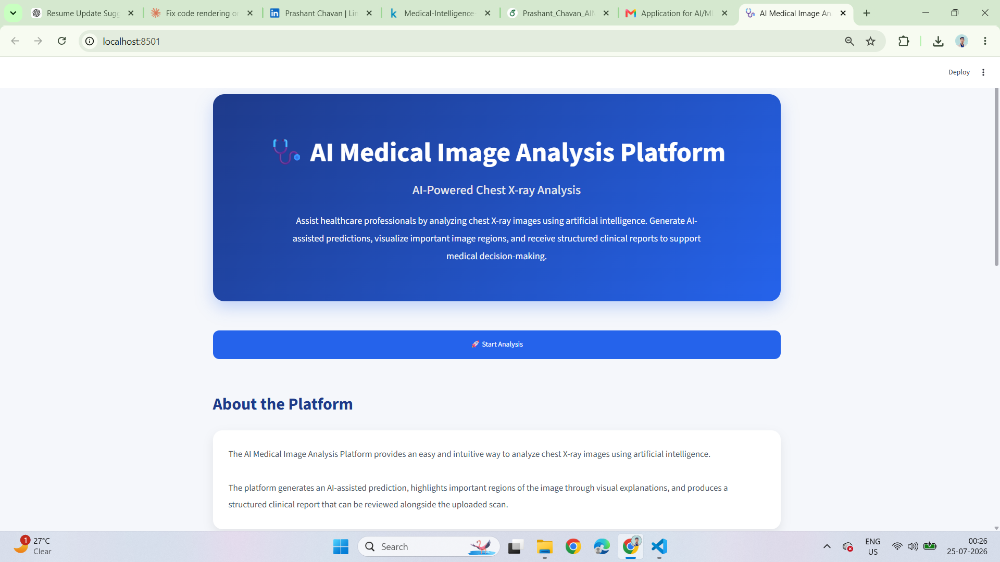
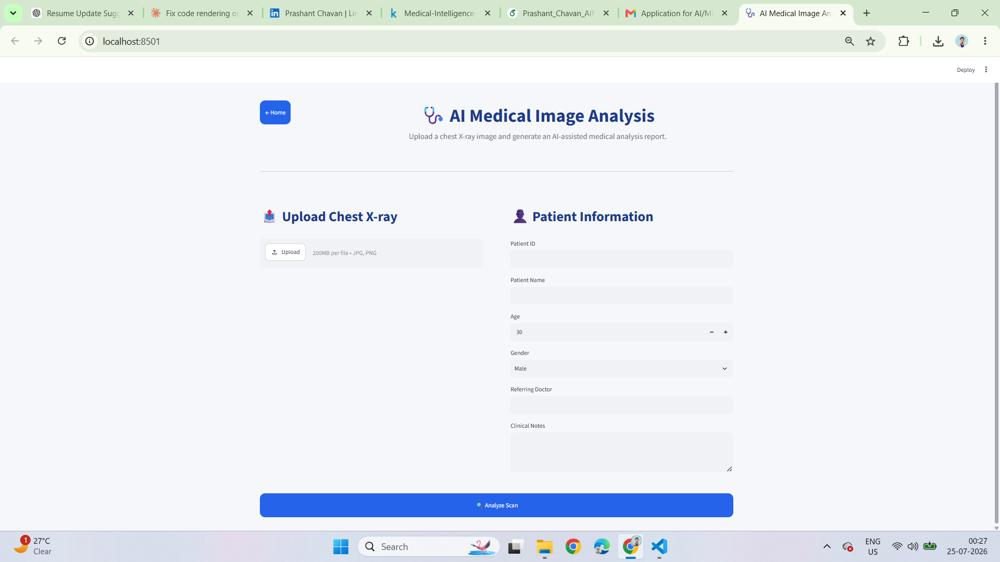
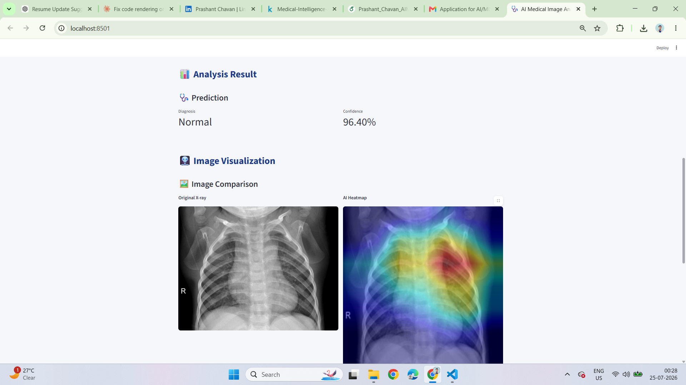

# 🩺 AI Medical Image Analysis Platform

An AI-powered web application that analyzes chest X-ray images and generates AI-assisted medical reports. The application uses a deep learning model for image classification and Google Gemini AI to create structured clinical summaries.

## Features

- Upload chest X-ray images for analysis
- AI-based disease prediction using a CNN model
- Grad-CAM visualization for model explainability
- AI-generated clinical reports using Google Gemini
- Download reports as PDF
- Patient record management with SQLite
- Interactive Streamlit dashboard

## Tech Stack

- Python
- TensorFlow
- FastAPI
- Streamlit
- OpenCV
- Google Gemini AI
- SQLAlchemy
- SQLite
- Matplotlib

## Project Structure

```
Medical_Image_Analysis/
│── backend/
│── frontend/
│── models/
│── uploads/
│── reports/
│── database/
│── requirements.txt
│── README.md
```

## Installation

Clone the repository:

```bash
git clone https://github.com/Prashant-Chava/Medical_Image_Analysis.git
cd Medical_Image_Analysis
```

Install the dependencies:

```bash
pip install -r requirements.txt
```

## Run the Backend

```bash
uvicorn main:app --reload
```

## Run the Frontend

```bash
streamlit run frontend/app.py
```

## Screenshots

## Home Page



---

## Analysis Page



---

## Prediction Result



## Future Improvements

- Support multiple chest diseases
- User authentication
- Cloud deployment
- Prediction history dashboard

## Author

**Prashant Chavan**

LinkedIn: https://www.linkedin.com/in/prashant-chavan-538980285/

GitHub: https://github.com/Prashant-Chava